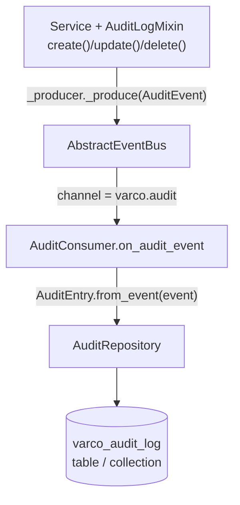

# Database Auditing — Technical Reference

`varco_core.service.audit` ships a complete, event-driven audit trail for entity
mutations — an append-only log of every `create`/`update`/`delete` performed
through `AsyncService`, persisted by `varco_sa` or `varco_beanie`. The code has
existed since before this guide; this page documents how to wire it up.

## What you get

Each mutation produces one `AuditEntry` (`varco_core/varco_core/service/audit.py:90`):

| Field | Meaning |
|---|---|
| `entry_id` | `UUID`, generated per record — the idempotency key (see the Postgres/Mongo behaviour below). |
| `entity_type` | The mutated entity class name (e.g. `"Order"`). |
| `entity_id` | `str(pk)` — string form of the primary key, so int/UUID/composite keys all fit the same field. |
| `action` | `"create"` \| `"update"` \| `"delete"`. |
| `actor_id` | Caller identity — `None` unless the service overrides `_get_audit_actor(ctx)`. |
| `diff` | Field-level change data. `create`: the full `read_dto.model_dump()`. `update`: `{"before": ..., "after": ...}`, both full dumps. `delete`: `{}` — the entity is gone by hook time. |
| `occurred_at` | UTC timestamp set when the *consumer persists* the record (`AuditEntry.from_event`), **not** when the service emitted it. |
| `correlation_id` | Optional request-tracing id — `None` unless populated by event middleware wired on your bus (`varco_core.event.middleware`). |
| `tenant_id` | Optional — read from `ctx.metadata.get("tenant_id")` at emission time. |

## Flow

The mixin never writes to a database directly — it emits an event, and a separate
consumer persists it:



`AuditEvent` (`varco_core/varco_core/event/audit_event.py`) sets
`__event_type__: ClassVar[str] = "varco.audit"` and is published on the
`"varco.audit"` channel — a dedicated channel that keeps audit traffic separate
from domain event channels.

---

## Step 1 — compose `AuditLogMixin`

Place it **to the left of `AsyncService`** in the MRO so its `_after_create`/
`_after_update`/`_after_delete` overrides run (and chain via `super()`) around the
base no-op hooks:

```python
from varco_core.service.audit import AuditLogMixin
from varco_core.service.base import AsyncService

class OrderService(
    AuditLogMixin,
    AsyncService[Order, UUID, CreateOrderDTO, OrderReadDTO, UpdateOrderDTO],
):
    def _get_repo(self, uow):
        return uow.orders

    def _get_audit_actor(self, ctx) -> str | None:
        return ctx.sub  # JWT subject — override the base "always None"
```

`AuditLogMixin` requires the service's existing injected `AbstractEventProducer`
(`self._producer`) — no extra constructor parameter. If the service was built
without a real producer, `AsyncService.__init__` defaults `_producer` to a
`NoopEventProducer()`, so audit events are silently dropped rather than raising;
make sure a real producer (backed by `AbstractEventBus`) is wired if you want
audit records to actually reach the consumer.

The hooks fire **after the domain transaction commits** (`_after_create` etc. are
called from `AsyncService.create()`/`.update()`/`.delete()` right after `repo.save`/
`repo.delete`), so if `_produce()` itself raises, the entity is already persisted —
only the audit event publish failed.

---

## Step 2a — varco_sa (SQLAlchemy)

```python
from sqlalchemy.ext.asyncio import async_sessionmaker
from varco_sa.audit import SAAuditRepository
from varco_core.service.audit import AuditConsumer

session_factory = async_sessionmaker(engine)
audit_repo = SAAuditRepository(session_factory)

consumer = AuditConsumer(audit_repo=audit_repo)
```

`SAAuditRepository` writes to the `varco_audit_log` table (`AuditEntryModel`) using
a **fresh session per operation**, auto-committing after `save()` — the consumer
never has to manage a SQLAlchemy session itself.

**Alembic wiring** — `AuditEntryModel` lives on its own `DeclarativeBase`, isolated
from your app's `Base`, so you must opt it into migrations explicitly:

```python
# env.py
from varco_sa.audit import audit_metadata

target_metadata = [Base.metadata, outbox_metadata, audit_metadata]
```

**Dev-only quick start** (no Alembic — creates the table directly):

```python
from varco_sa.audit import audit_metadata

async with engine.begin() as conn:
    await conn.run_sync(audit_metadata.create_all)
```

For strict-consistency writes inside the same UoW transaction as the domain
entity (see "Relation to the outbox" below), use
`SAAuditRepository._from_session(session)` — that variant does **not**
auto-commit; the caller's UoW controls the commit boundary.

## Step 2b — varco_beanie (MongoDB)

```python
from beanie import init_beanie
from varco_beanie.audit import AuditDocument, BeanieAuditRepository
from varco_core.service.audit import AuditConsumer

await init_beanie(database=db, document_models=[Order, AuditDocument])

consumer = AuditConsumer(audit_repo=BeanieAuditRepository())
```

`AuditDocument` maps to the `varco_audit_log` collection. `AuditDocument.Settings.indexes`
is deliberately empty in the shipped code — add a compound index on
`{entity_type: 1, entity_id: 1, occurred_at: -1}` yourself (migration or Atlas UI)
if `list_for_entity()` will be called frequently in production; without it,
`list_for_entity()` sorts in memory.

---

## Step 3 — wire the consumer

`AuditConsumer.register_to(bus)` must be called from a `@PostConstruct` method,
never from `__init__` (project-wide rule — subscribing in `__init__` couples
service construction to bus readiness and makes unit testing harder):

```python
from providify import Component, Inject, PostConstruct
from varco_core.event.base import AbstractEventBus
from varco_core.service.audit import AuditConsumer
from varco_sa.audit import SAAuditRepository

@Component
class AuditWiring:
    def __init__(self, bus: Inject[AbstractEventBus], audit_repo: Inject[SAAuditRepository]) -> None:
        self._bus = bus
        self._consumer = AuditConsumer(audit_repo=audit_repo)

    @PostConstruct
    def _setup(self) -> None:
        self._consumer.register_to(self._bus)
```

## Step 4 — reading the trail

```python
entries = await audit_repo.list_for_entity("Order", str(order_id), limit=50)
# newest-first — AuditEntry objects, occurred_at DESC
```

---

## Consistency: "eventually consistent via events"

The audit row is written **after** the domain transaction commits, by a consumer
that may run in another process — this is the same eventual-consistency trade-off
as any other `AbstractEventProducer`-based side effect in the codebase.

Failure modes depend on which bus backend you use:

- **`InMemoryEventBus`** — the audit event dies with the process if it hasn't been
  dispatched yet. Fine for tests; never use it for audit trails you actually rely on.
- **Kafka / Redis** — at-least-once delivery, so the same `AuditEvent` can be
  delivered to the consumer more than once (e.g. after a consumer crash and
  rebalance). Duplicates are possible — see the idempotency behaviour below.

`AuditConsumer.on_audit_event` is declared as:

```python
@listen(AuditEvent, channel="varco.audit")
async def on_audit_event(self, event: Event) -> None: ...
```

**with no `retry_policy` and no `dlq`** — a transient DB failure in
`audit_repo.save()` propagates straight to the bus's error policy with no automatic
retry. If you need resilience, subclass `AuditConsumer` and re-declare the handler
with `retry_policy=`/`dlq=` (the `@listen` decorator is evaluated at class-definition
time, so a subclass override with a new `@listen(...)` call replaces the parent's
registration for that method — this is the same pattern used elsewhere for
retry-wrapped listeners):

```python
from varco_core.resilience import RetryPolicy
from varco_core.event.dlq import InMemoryDeadLetterQueue

class ResilientAuditConsumer(AuditConsumer):
    @listen(
        AuditEvent,
        channel="varco.audit",
        retry_policy=RetryPolicy(max_attempts=3, base_delay=1.0),
        dlq=InMemoryDeadLetterQueue(),
    )
    async def on_audit_event(self, event) -> None:
        await super().on_audit_event(event)
```

### Idempotency — verified per backend (do not assume both behave the same)

- **`SAAuditRepository.save`** (`varco_sa/varco_sa/audit.py`) **does** attempt a
  Postgres `INSERT ... ON CONFLICT (entry_id) DO NOTHING` via
  `sqlalchemy.dialects.postgresql.insert(...).on_conflict_do_nothing(index_elements=["entry_id"])`
  — on Postgres, re-delivering the same `AuditEvent` (same `entry_id`) is a
  genuine no-op, safe for at-least-once Kafka/Redis delivery. If that statement
  raises (e.g. running against SQLite, as the test suite does, where the Postgres
  dialect construct is not supported), the code falls back to a plain
  `session.add(AuditEntryModel(...))` — on that fallback path, a duplicate
  `entry_id` raises `IntegrityError` instead of being silently ignored. In other
  words: idempotent-on-conflict **only on Postgres**; non-Postgres dialects raise
  on redelivery duplicates unless you catch `IntegrityError` around the consumer
  call (or add a `retry_policy` with a filter that treats it as success).
- **`BeanieAuditRepository.save`** (`varco_beanie/varco_beanie/audit.py`) does a
  **plain, unconditional `doc.insert()`** — there is no conflict handling at all.
  A redelivered `AuditEvent` with the same `entry_id` raises
  `pymongo.errors.DuplicateKeyError` (Beanie's default unique index on `_id`).
  Treat that exception as "already persisted" at the call site (or in a
  `retry_policy`/wrapper) if you expect redelivery.

### Relation to the outbox

For a **compliance-grade "must not lose an audit record"** guarantee, save the
`AuditEvent` as an `OutboxEntry` inside the same UoW transaction as the entity
write, and let `OutboxRelay` publish it — turning the audit trail into an
at-least-once, transactionally-safe pipeline end-to-end (the domain write and the
"an audit event will eventually be published" fact commit atomically together).
This is not wired by default — `AuditLogMixin` publishes directly via
`self._producer._produce()`, not through an outbox — you would override the
`_after_create`/`_after_update`/`_after_delete` hooks (calling `super()` last, as
usual) to write an `OutboxEntry.from_event(audit_event)` via `OutboxRepository`
instead of (or in addition to) the default `_produce()` call.

---

## Pitfalls

| Pitfall | Symptom | Root cause | Fix |
|---|---|---|---|
| Audit entries never written | Service emits, DB table stays empty | `AuditConsumer.register_to(bus)` never called | Call it from a `@PostConstruct` method |
| `relation "varco_audit_log" does not exist` | Consumer raises on first audit event | `audit_metadata` not in the Alembic `target_metadata` | Add `from varco_sa.audit import audit_metadata` to `env.py` |
| `CollectionWasNotInitialized` on audit save | Beanie raises when the consumer persists | `AuditDocument` missing from `init_beanie(document_models=...)` | Register it at startup |
| Audit record lost on broker outage | Domain write committed, no audit row | Audit is emitted post-commit as a plain event | Emit the `AuditEvent` through the transactional outbox |
| Duplicate audit rows after a consumer restart (Kafka/Redis) | Two rows with different `entry_id` timestamps for one mutation, or an `IntegrityError`/`DuplicateKeyError` | At-least-once redelivery — Postgres dedupes on `entry_id` via `ON CONFLICT DO NOTHING`, but SQLite/MySQL and MongoDB do not | On Postgres this is already safe; on other dialects/Mongo, treat `IntegrityError`/`DuplicateKeyError` as success in the consumer or a `retry_policy` filter |
