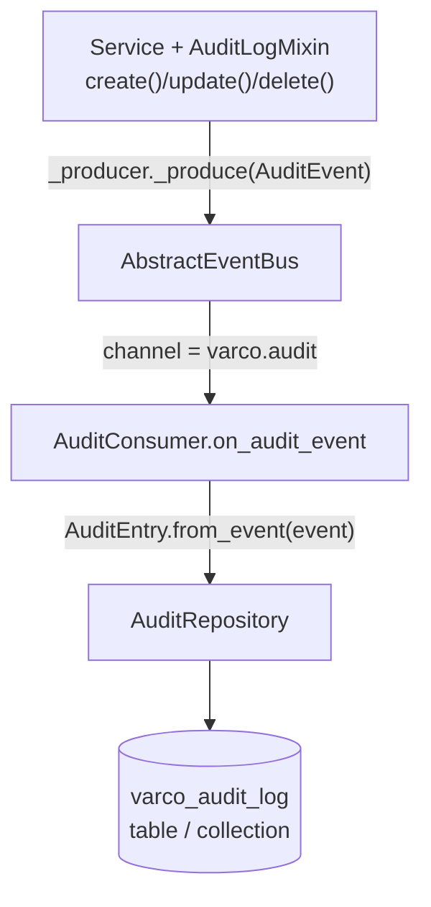

# Database Auditing — Technical Reference

`varco_core.service.audit` ships a complete, event-driven audit trail for entity
mutations — an append-only log of every `create`/`update`/`delete` performed
through `AsyncService`, persisted by `varco_sa` or `varco_beanie`. The code has
existed since before this guide; this page documents how to wire it up.

## What you get

Each mutation produces one `AuditEntry` (`varco_core/varco_core/service/audit.py:90`):

| Field | Meaning |
|---|---|
| `entry_id` | `UUID`, generated per record — the idempotency key (see the Postgres/Mongo behaviour below). |
| `entity_type` | The mutated entity class name (e.g. `"Order"`). |
| `entity_id` | `str(pk)` — string form of the primary key, so int/UUID/composite keys all fit the same field. |
| `action` | `"create"` \| `"update"` \| `"delete"`. |
| `actor_id` | Caller identity — `None` unless the service overrides `_get_audit_actor(ctx)`. |
| `diff` | Field-level change data. `create`: the full `read_dto.model_dump()`. `update`: `{"before": ..., "after": ...}`, both full dumps. `delete`: `{}` — the entity is gone by hook time. |
| `occurred_at` | UTC timestamp set when the *consumer persists* the record (`AuditEntry.from_event`), **not** when the service emitted it. |
| `correlation_id` | Optional request-tracing id — `None` unless populated by event middleware wired on your bus (`varco_core.event.middleware`). |
| `tenant_id` | Optional — read from `ctx.metadata.get("tenant_id")` at emission time. |

## Flow

The mixin never writes to a database directly — it emits an event, and a separate
consumer persists it:



`AuditEvent` (`varco_core/varco_core/event/audit_event.py`) sets
`__event_type__: ClassVar[str] = "varco.audit"` and is published on the
`"varco.audit"` channel — a dedicated channel that keeps audit traffic separate
from domain event channels.

---

## Step 1 — compose `AuditLogMixin`

Place it **to the left of `AsyncService`** in the MRO so its `_after_create`/
`_after_update`/`_after_delete` overrides run (and chain via `super()`) around the
base no-op hooks:

```python
from varco_core.service.audit import AuditLogMixin
from varco_core.service.base import AsyncService

class OrderService(
    AuditLogMixin,
    AsyncService[Order, UUID, CreateOrderDTO, OrderReadDTO, UpdateOrderDTO],
):
    def _get_repo(self, uow):
        return uow.orders

    def _get_audit_actor(self, ctx) -> str | None:
        return ctx.sub  # JWT subject — override the base "always None"
```

`AuditLogMixin` requires the service's existing injected `AbstractEventProducer`
(`self._producer`) — no extra constructor parameter. If the service was built
without a real producer, `AsyncService.__init__` defaults `_producer` to a
`NoopEventProducer()`, so audit events are silently dropped rather than raising;
make sure a real producer (backed by `AbstractEventBus`) is wired if you want
audit records to actually reach the consumer.

The hooks fire **after the domain transaction commits** (`_after_create` etc. are
called from `AsyncService.create()`/`.update()`/`.delete()` right after `repo.save`/
`repo.delete`), so if `_produce()` itself raises, the entity is already persisted —
only the audit event publish failed.

---

## Step 2a — varco_sa (SQLAlchemy)

```python
from sqlalchemy.ext.asyncio import async_sessionmaker
from varco_sa.audit import SAAuditRepository
from varco_core.service.audit import AuditConsumer

session_factory = async_sessionmaker(engine)
audit_repo = SAAuditRepository(session_factory)

consumer = AuditConsumer(audit_repo=audit_repo)
```

`SAAuditRepository` writes to the `varco_audit_log` table (`AuditEntryModel`) using
a **fresh session per operation**, auto-committing after `save()` — the consumer
never has to manage a SQLAlchemy session itself.

**Alembic wiring** — `AuditEntryModel` lives on its own `DeclarativeBase`, isolated
from your app's `Base`, so you must opt it into migrations explicitly:

```python
# env.py
from varco_sa.audit import audit_metadata

target_metadata = [Base.metadata, outbox_metadata, audit_metadata]
```

**Dev-only quick start** (no Alembic — creates the table directly):

```python
from varco_sa.audit import audit_metadata

async with engine.begin() as conn:
    await conn.run_sync(audit_metadata.create_all)
```

For strict-consistency writes inside the same UoW transaction as the domain
entity (see "Relation to the outbox" below), use
`SAAuditRepository._from_session(session)` — that variant does **not**
auto-commit; the caller's UoW controls the commit boundary.

## Step 2b — varco_beanie (MongoDB)

```python
from beanie import init_beanie
from varco_beanie.audit import AuditDocument, BeanieAuditRepository
from varco_core.service.audit import AuditConsumer

await init_beanie(database=db, document_models=[Order, AuditDocument])

consumer = AuditConsumer(audit_repo=BeanieAuditRepository())
```

`AuditDocument` maps to the `varco_audit_log` collection. `AuditDocument.Settings.indexes`
is deliberately empty in the shipped code — add a compound index on
`{entity_type: 1, entity_id: 1, occurred_at: -1}` yourself (migration or Atlas UI)
if `list_for_entity()` will be called frequently in production; without it,
`list_for_entity()` sorts in memory.

---

## Step 3 — wire the consumer

`AuditConsumer.register_to(bus)` must be called from a `@PostConstruct` method,
never from `__init__` (project-wide rule — subscribing in `__init__` couples
service construction to bus readiness and makes unit testing harder):

```python
from providify import Component, Inject, PostConstruct
from varco_core.event.base import AbstractEventBus
from varco_core.service.audit import AuditConsumer
from varco_sa.audit import SAAuditRepository

@Component
class AuditWiring:
    def __init__(self, bus: Inject[AbstractEventBus], audit_repo: Inject[SAAuditRepository]) -> None:
        self._bus = bus
        self._consumer = AuditConsumer(audit_repo=audit_repo)

    @PostConstruct
    def _setup(self) -> None:
        self._consumer.register_to(self._bus)
```

## Step 4 — reading the trail

```python
entries = await audit_repo.list_for_entity("Order", str(order_id), limit=50)
# newest-first — AuditEntry objects, occurred_at DESC
```

---

## Consistency: "eventually consistent via events"

The audit row is written **after** the domain transaction commits, by a consumer
that may run in another process — this is the same eventual-consistency trade-off
as any other `AbstractEventProducer`-based side effect in the codebase.

Failure modes depend on which bus backend you use:

- **`InMemoryEventBus`** — the audit event dies with the process if it hasn't been
  dispatched yet. Fine for tests; never use it for audit trails you actually rely on.
- **Kafka / Redis** — at-least-once delivery, so the same `AuditEvent` can be
  delivered to the consumer more than once (e.g. after a consumer crash and
  rebalance). Duplicates are possible — see the idempotency behaviour below.

`AuditConsumer.on_audit_event` is declared as:

```python
@listen(AuditEvent, channel="varco.audit")
async def on_audit_event(self, event: Event) -> None: ...
```

**Safe-by-default since Plan 005 Phase 3 (U-6 §2)** — the bare `@listen` decoration
above carries no `retry_policy`/`dlq` at class-definition time, but
`AuditConsumer.register_to(bus)` applies
`_default_retry_policy = RetryPolicy.durable_delivery()` (`max_attempts=20,
base_delay=15.0, max_delay=3600.0`) and the constructor's `dlq=` **unless the
caller explicitly overrides them** — so a transient DB failure in
`audit_repo.save()` is now retried for minutes before giving up, instead of
propagating straight to the bus's error policy on the first failure.

**Opt out explicitly** for the old fire-and-forget (single-attempt,
no-DLQ) behaviour by passing `retry_policy=None` to `register_to()`:

```python
consumer = AuditConsumer(audit_repo=audit_repo)
consumer.register_to(bus, retry_policy=None)   # restores pre-Phase-3 behaviour
```

Or supply your own policy/DLQ instead of the `durable_delivery()` default:

```python
from varco_core.resilience import RetryPolicy
from varco_core.event.dlq import InMemoryDeadLetterQueue

consumer = AuditConsumer(audit_repo=audit_repo, dlq=InMemoryDeadLetterQueue())
consumer.register_to(bus, retry_policy=RetryPolicy(max_attempts=3, base_delay=1.0))
```

### Idempotency — verified per backend (do not assume both behave the same)

- **`SAAuditRepository.save`** (`varco_sa/varco_sa/audit.py`) **does** attempt a
  Postgres `INSERT ... ON CONFLICT (entry_id) DO NOTHING` via
  `sqlalchemy.dialects.postgresql.insert(...).on_conflict_do_nothing(index_elements=["entry_id"])`
  — on Postgres, re-delivering the same `AuditEvent` (same `entry_id`) is a
  genuine no-op, safe for at-least-once Kafka/Redis delivery. If that statement
  raises (e.g. running against SQLite, as the test suite does, where the Postgres
  dialect construct is not supported), the code falls back to a plain
  `session.add(AuditEntryModel(...))` — on that fallback path, a duplicate
  `entry_id` raises `IntegrityError` instead of being silently ignored. In other
  words: idempotent-on-conflict **only on Postgres**; non-Postgres dialects raise
  on redelivery duplicates unless you catch `IntegrityError` around the consumer
  call (or add a `retry_policy` with a filter that treats it as success).
- **`BeanieAuditRepository.save`** (`varco_beanie/varco_beanie/audit.py`) does a
  **plain, unconditional `doc.insert()`** — there is no conflict handling at all.
  A redelivered `AuditEvent` with the same `entry_id` raises
  `pymongo.errors.DuplicateKeyError` (Beanie's default unique index on `_id`).
  Treat that exception as "already persisted" at the call site (or in a
  `retry_policy`/wrapper) if you expect redelivery.

### Relation to the outbox

For a **compliance-grade "must not lose an audit record"** guarantee, save the
`AuditEvent` as an `OutboxEntry` inside the same UoW transaction as the entity
write, and let `OutboxRelay` publish it — turning the audit trail into an
at-least-once, transactionally-safe pipeline end-to-end (the domain write and the
"an audit event will eventually be published" fact commit atomically together).
This is not wired by default — `AuditLogMixin` publishes directly via
`self._producer._produce()`, not through an outbox — you would override the
`_after_create`/`_after_update`/`_after_delete` hooks (calling `super()` last, as
usual) to write an `OutboxEntry.from_event(audit_event)` via `OutboxRepository`
instead of (or in addition to) the default `_produce()` call.

---

## Retention — `delete_where()`

Plan 009, Phase 2 (R3). `AuditRepository.delete_where(older_than=, entity_type=,
tenant_id=, limit=, allow_chain_break=False)` is concrete-but-raising on the
ABC — a destructive bulk delete has no safe portable default, same reasoning
as `AbstractDeadLetterQueue.delete_where`. `SAAuditRepository` and
`BeanieAuditRepository` both implement it. No predicate at all → `ValueError`
(refuses to silently truncate the audit log); `limit=` caps rows deleted per
call for a chunked sweep (repeated calls until `0` is returned).

```bash
varco retention prune --type audit --before 2025-01-01T00:00:00Z --limit 5000 \
    --target module:factory   # or VARCO_RETENTION_TARGET
varco retention prune --type audit --before ... --dry-run
```

⚠️ **Interaction with the hash chain (Phase 12, see below)**: on a table with
`hash_chain=True`, `delete_where()` breaks the chain by construction — a
deleted row is indistinguishable from a `ChainGap` at `verify_chain()` time.
Both backends **raise unless `allow_chain_break=True` is passed explicitly**.
There is no way to prune a hash-chained audit log silently.

## Multitenancy (Plan 009, Phase 6 / R4)

`AuditRepository.list_for_entity(entity_type, entity_id, *, limit=100,
tenant_id=None)` gained a **breaking**, keyword-only `tenant_id` parameter.
This is a deliberate breaking change on an existing `@abstractmethod`: a
second `list_for_entity_scoped()` method would guarantee the unsafe,
unscoped one keeps being called by existing code — which is the actual
security bug this fixes. An out-of-tree `AuditRepository` subclass that does
not accept `tenant_id` now breaks loudly (`TypeError`) at call time instead
of silently ignoring the filter. See the migration note
(`technical_docs/migrations/009-reliability-and-integration.md`) for the
upgrade recipe.

```python
entries = await audit_repo.list_for_entity("Order", str(order_id), tenant_id="acme")
```

### Postgres RLS on `varco_audit_log`

Same `framework_rls_upgrade`/`framework_rls_downgrade` helpers as
`varco_dead_letters` — see the "Multitenancy" section of
`technical_docs/features/dead-letter-queues.md` for the full recipe and the
`(SELECT current_setting(..., true))` InitPlan rationale. Nothing enables
RLS automatically; paste the two calls into a reviewed Alembic revision.

## REST admin surface

Plan 009, Phase 10 (R6). `build_audit_router(audit_repo, allow_delete=False, ...)`
(`varco_fastapi.admin.audit_router`) — same plain-`APIRouter` precedent as
the DLQ admin router:

| Method | Path | Notes |
|---|---|---|
| GET | `/audit/entries` | all `list()` filters (`actor_id`, `action`, `entity_type`, `entity_id`, `tenant_id`, `correlation_id`, `occurred_from`, `occurred_to`, `limit`, `offset`) as query params |
| GET | `/audit/entries/{entry_id}` | 404 when absent |
| GET | `/audit/entries/{entity_type}/{entity_id}` | `list_for_entity()` |
| POST | `/audit/verify-chain` | hash-chain verification (Phase 12, see below); 501 if the repository doesn't implement `list()` |
| DELETE | `/audit/entries` | retention sweep — **only registered when `allow_delete=True`** |

`AuditRepository.list(actor_id=, action=, entity_type=, entity_id=, tenant_id=,
correlation_id=, occurred_from=, occurred_to=, limit=100, offset=0)` is a new
concrete-but-raising ABC member (no portable scan primitive exists to build
a default from) that `SAAuditRepository`/`BeanieAuditRepository` implement
and this router drives.

`allow_delete=False` by default: an audit log you can `DELETE` over HTTP is
not an audit log — retention belongs to the CLI/sweep job. Mount both admin
routers together (with the DLQ one) via `mount_reliability_admin()`:

```python
from varco_fastapi.admin.mount import mount_reliability_admin

mount_reliability_admin(
    app,
    audit_repo=audit_repo,
    acknowledge_bundled_admin=True,   # required — ValueError without it (RD-9)
    server_auth=auth, admin_role="reliability-admin",
)
```

No env var mounts this surface — ever. `server_auth=None` mounts
unauthenticated and logs one WARNING naming the risk. See
`technical_docs/features/dead-letter-queues.md`'s "REST admin surface"
section for the shared design rationale (RD-9).

## Tamper evidence — hash chain (Plan 009, Phase 12 / R8)

Optional, opt-in, ships last. Each `AuditEntry` can carry a
`prev_hash: str | None` and `seq: int | None`; `AuditEntry.entry_hash()`
computes a SHA-256 over a canonical JSON encoding (sorted keys, no
whitespace, RFC 3339 UTC timestamps) of `entry_id | occurred_at | action |
entity_type | entity_id | actor_id | tenant_id | correlation_id | diff |
prev_hash`. The genesis entry hashes `prev_hash=None` as the JSON literal
`null`.

```python
from varco_sa.audit import SAAuditRepository

audit_repo = SAAuditRepository(session_factory, hash_chain=True)   # opt-in, default False
```

```python
from varco_core.service.audit import AuditRepository

result = AuditRepository.verify_chain(entries)   # portable @staticmethod, pure
if result is True:
    ...  # unbroken (or vacuously true for an empty list)
else:
    for finding in result:   # list[ChainGap | HashMismatch]
        ...  # ChainGap = a missing seq (e.g. a deleted row)
             # HashMismatch = a prev_hash that doesn't match (e.g. an edited row)
```

**RD-8 — the chain is a repository concern, not a consumer concern, and is
global per repository.** Computing `prev_hash` inside `AuditConsumer` would
fork the chain silently under two concurrent consumer instances. Instead the
link is established inside `save()` under a backend-level serialization
guarantee:

- **SA** (`SAAuditRepository._save_chained`): a monotone `seq BIGSERIAL` +
  `SELECT ... ORDER BY seq DESC LIMIT 1 FOR UPDATE` on Postgres. SQLite (used
  in tests) has no row-level locking, so an additional in-process
  `asyncio.Lock` serializes concurrent `save()` calls within one process —
  this is **not** a substitute for `FOR UPDATE` across multiple processes; on
  SQLite the guarantee only holds within a single process.
- **Beanie** (`BeanieAuditRepository`): a dedicated `varco_audit_seq` counter
  document with `find_one_and_update({$inc})`, created on first write with
  `upsert=True`. The counter collection is resolved from `AuditDocument`'s
  **own** database, so `hash_chain=True` needs **no extra**
  `init_beanie(document_models=...)` entry — registering `AuditDocument`
  remains the only required step. (`AuditSeqDocument` is exported for
  operators who want to register it deliberately for index/migration tooling;
  it is schema documentation, not the access path.)

  ⚠️ A chained Beanie entry's `occurred_at` is truncated to **whole
  milliseconds** before it is hashed and stored — BSON datetimes have
  millisecond resolution, so a microsecond-precision timestamp would not
  round-trip and `verify_chain()` would report a `HashMismatch` on every
  link. `seq`, not `occurred_at`, is the chain's ordering key, so nothing
  chain-relevant is lost. The SA backend is unaffected and keeps hashing
  microseconds.

### ⚠️ Throughput caveat — read before enabling in a hot path

`hash_chain=True` caps audit write throughput at **one serialized write per
record** — every `save()` must read-then-write the last chain link before
committing its own. This is the documented cost of a correct chain under
concurrency (RD-8), not a bug. The feature is opt-in specifically so
existing, throughput-sensitive deployments are unaffected by default
(`hash_chain=False`).

### Retention interaction

Pruning a hash-chained table breaks the chain by construction — see
"Retention" above. `delete_where(..., allow_chain_break=True)` is the only
way to prune a chained table; `verify_chain()` afterward reports the pruned
range as a `ChainGap`, not silently as an unbroken chain.

✅ **Verification status**: `BeanieAuditRepository(hash_chain=True)` is
covered by `varco_beanie/tests/test_beanie_audit_chain.py`, which now runs
green against a live MongoDB container. That run exposed — and this release
fixes — a `CollectionWasNotInitialized` raised on the first chained write:
the counter was reached through `AuditSeqDocument.get_pymongo_collection()`,
which required a second, undocumented `init_beanie()` registration.
`SAAuditRepository(hash_chain=True)` **is** covered by a non-integration
SQLite suite (`varco_sa/tests/test_sa_audit_chain.py`), including a
20-concurrent-tasks test asserting a single unbroken chain.

## Pitfalls

| Pitfall | Symptom | Root cause | Fix |
|---|---|---|---|
| Audit entries never written | Service emits, DB table stays empty | `AuditConsumer.register_to(bus)` never called | Call it from a `@PostConstruct` method |
| `relation "varco_audit_log" does not exist` | Consumer raises on first audit event | `audit_metadata` not in the Alembic `target_metadata` | Add `from varco_sa.audit import audit_metadata` to `env.py` |
| `CollectionWasNotInitialized` on audit save | Beanie raises when the consumer persists | `AuditDocument` missing from `init_beanie(document_models=...)` | Register it at startup — this is the **only** required registration, including with `hash_chain=True` (the `varco_audit_seq` counter rides on `AuditDocument`'s database) |
| Audit record lost on broker outage | Domain write committed, no audit row | Audit is emitted post-commit as a plain event | Emit the `AuditEvent` through the transactional outbox |
| Duplicate audit rows after a consumer restart (Kafka/Redis) | Two rows with different `entry_id` timestamps for one mutation, or an `IntegrityError`/`DuplicateKeyError` | At-least-once redelivery — Postgres dedupes on `entry_id` via `ON CONFLICT DO NOTHING`, but SQLite/MySQL and MongoDB do not | On Postgres this is already safe; on other dialects/Mongo, treat `IntegrityError`/`DuplicateKeyError` as success in the consumer or a `retry_policy` filter |
| `list_for_entity()` override missing `tenant_id` | `TypeError` on any call site passing it | An out-of-tree `AuditRepository` subclass predates Plan 009 (R4) | Add `tenant_id: str \| None = None` to your override and filter on it |
| `delete_where()` on a chained table | `ValueError` by design | Pruning breaks the hash chain; refuses silently doing so | Pass `allow_chain_break=True` if you accept the chain gap |
| `hash_chain=True` enabled on a high-throughput audit table | Write latency/serialization bottleneck | Every `save()` is now a serialized read-then-write (RD-8, documented cost) | Only enable where tamper evidence is worth the throughput cap; leave `hash_chain=False` (default) otherwise |
| `mount_reliability_admin()` without `acknowledge_bundled_admin=True` | `ValueError` — friction is intentional | This surface can replay/delete records, at least as privileged as the tenant admin (RD-9) | Pass it only after confirming a standalone deployment isn't justified |
