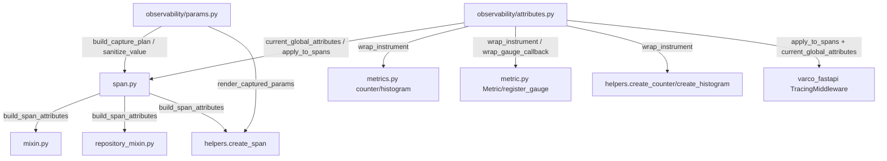

# OTel Automatic Parameter Capture & Global Attributes — Technical Reference

Two additions to `varco_core.observability`, both opt-out rather than opt-in:

- **Automatic parameter capture** (`varco_core.observability.params`) — every `@span`
  (and `TracingServiceMixin`/`TracingRepositoryMixin`/`create_span`) can record the
  decorated function's call arguments as `param.<name>` span attributes, with
  redaction, truncation, and a global + per-decorator kill switch.
- **Global attribute registry** (`varco_core.observability.attributes`) — a
  process-wide set of key/value pairs stamped on **every span** and **every metric
  measurement** (counter / up-down counter / histogram / observable gauge),
  supporting static values, env-var-sourced values, and callable providers.

Both ship with a runtime env-var bootstrap, so `VARCO_OTEL_GLOBAL_ATTRS="k8s.pod.name=$(POD_NAME)"`
labels every span and metric with **zero code changes**.

---

## Core files

| File | Role |
|---|---|
| `varco_core/observability/params.py` | `ParamCaptureConfig`, `CapturePlan`/`build_capture_plan`, `sanitize_value`, the process-wide capture kill switch |
| `varco_core/observability/attributes.py` | `GlobalAttributes` registry, module singleton + free functions, `wrap_instrument`/`wrap_gauge_callback` |
| `varco_core/observability/span.py` | `SpanConfig.capture_params`/`.param_capture`; `build_span_attributes()` — the shared span-attribute merge helper |
| `varco_core/observability/mixin.py` / `repository_mixin.py` | `TracingServiceMixin` / `TracingRepositoryMixin` — call `build_span_attributes()` too (see caveat below) |
| `varco_core/observability/helpers.py` | `create_span(..., params=...)`, `create_counter`/`create_histogram` (wrap at creation) |
| `varco_core/observability/metrics.py` / `metric.py` | `@counter`/`@histogram`, `Metric`, `register_gauge` — all wrap their instrument via `wrap_instrument()`/`wrap_gauge_callback()` |
| `varco_core/observability/config.py` | `OtelConfig` — `capture_params`, `param_capture`, `global_attributes*`, `promote_global_attrs_to_resource` |
| `varco_core/observability/di.py` | `OtelConfiguration.observability_attributes` — seeds the registry + capture defaults at bootstrap |
| `varco_fastapi/app.py` | `create_varco_app(..., global_attributes=, capture_params=)` — passthrough for FastAPI services |
| `varco_fastapi/middleware/tracing.py` | `TracingMiddleware` — the HTTP server span also carries global attributes |

The following diagram shows which module depends on which — both new modules
import only stdlib + the OTel API, never each other or any other observability
module, and every span/metric creation call site routes through them:



---

## (A) Automatic parameter capture

### How it works

`@span` (bare or configured), `create_span(..., params=...)`, and the two tracing
mixins all pass their attribute dict to `tracer.start_as_current_span(name,
attributes=merged, record_exception=False)` — attributes exist **from `t=0`**, so a
sampler can key on `param.tenant_id`.

For `@span`, the signature is introspected once via `inspect.signature()` — on the
**first call**, not at decoration time (decorators run at import time, before any
`OtelConfiguration`/`set_param_capture_defaults()` call could have run) — and the
resulting `CapturePlan` is memoised on the wrapper closure. Every subsequent call is
a `zip()` over positional args plus a filtered pass over `kwargs` — no
`Signature.bind()` on the hot path.

```python
from varco_core.observability import span, SpanConfig

@span
async def place_order(order_id: UUID, tenant_id: str, password: str = "") -> Order:
    ...

# Trace attributes produced by a call place_order(oid, "acme", password="x"):
#   param.order_id = "<uuid str>"
#   param.tenant_id = "acme"
#   param.password  = "[REDACTED]"          # name matched a redact pattern
```

### ⚠️ Known deviation from the original design — mixins do NOT capture `pk`/`dto`/`params`

`TracingServiceMixin` and `TracingRepositoryMixin` (`mixin.py` / `repository_mixin.py`)
call the same `build_span_attributes()` helper as `@span`, so their spans **do**
carry global attributes, `SpanConfig.attributes`, and `correlation_id` — but they
call it with `captured_params=None`:

```python
# mixin.py / repository_mixin.py — build_span_attributes(cfg.attributes) only
merged_attrs = build_span_attributes(cfg.attributes)
```

An earlier iteration of this feature intended for `OrderService.create` spans to
also carry `param.dto`/`param.pk`/`param.params` automatically. **That capture was
not implemented** — a `TracingServiceMixin`/`TracingRepositoryMixin` span never gets
`param.*` attributes, regardless of `capture_params`/`VARCO_OTEL_CAPTURE_PARAMS`.
If you need the entity id or DTO on a CRUD span, set it explicitly inside the
service method body (`opentelemetry.trace.get_current_span().set_attribute(...)`),
or wrap the specific call with `create_span(..., params={"pk": pk})`.

Only `@span`-decorated functions and `create_span(..., params=...)` calls get
automatic `param.*` capture.

### Value rendering (`sanitize_value`)

| Input | `value_mode="scalars"` (default) | `value_mode="repr"` |
|---|---|---|
| `str` | truncated to `max_value_length`, `…` suffix when cut | same |
| `int` / `float` / `bool` | native OTel scalar (no `str()`) | same |
| `None` | the string `"None"` | `"None"` |
| `UUID`, `Decimal`, `datetime`, `Enum`, `Path` | `str(value)`, truncated | same |
| `list`/`tuple`/`set` of one scalar type, `len <= max_sequence_items` | native OTel tuple | same |
| longer / heterogeneous sequence | `"<list len=1000>"` | `repr()` truncated |
| `dict`, Pydantic model, dataclass, any other object | `"<TypeName>"` (after validating `repr()` succeeds) | `repr()` truncated |

`sanitize_value` never raises — an object whose `__repr__`/`__str__` raises yields
the literal string `"<unrepresentable>"`. `CapturePlan.extract()` itself is wrapped
in `try/except Exception` and returns `{}` on failure (logged once at `DEBUG`) —
**instrumentation must never break the application**.

### Redaction and the PII section — read this before enabling in production

Capture defaults to **ON** (`VARCO_OTEL_CAPTURE_PARAMS=true`). Safety nets:

1. **Value rendering defaults to `"scalars"`**, not `"repr"` — a DTO carrying an
   email/IBAN/address renders as `"<OrderCreateDTO>"`, not its contents.
2. **Name-based redaction** — any parameter name containing (case-insensitively) one
   of `DEFAULT_REDACT_PATTERNS` is replaced with `"[REDACTED]"`, even if it is
   explicitly listed in `include=` (fail-closed):

   ```
   password, passwd, secret, token, authorization, auth, api_key, apikey,
   credential, private_key, cookie, session_id, otp, pin, ssn
   ```

**What redaction cannot do**: a parameter literally named `email` holding a string
**is captured** — the pattern list has no way to know every PII field name in your
domain. Mitigations, in order of granularity:

- Add the field name to `VARCO_OTEL_CAPTURE_PARAMS_EXCLUDE` (process-wide) or
  `ParamCaptureConfig(exclude=(...))` (per-decorator).
- Add a custom pattern to `ParamCaptureConfig(redact_patterns=DEFAULT_REDACT_PATTERNS + ("email",))`.
- Turn capture off for one call site: `@span(SpanConfig(capture_params=False))`.
- Turn capture off for the whole process: `VARCO_OTEL_CAPTURE_PARAMS=false`, or
  `set_capture_enabled(False)`, or `OtelConfig(capture_params=False)`.
- Reviewer escape hatch: flip `_DEFAULT_ENABLED = True` to `False` in `params.py` for
  a team that wants capture opt-in instead of opt-out (a one-line change, not
  configurable at runtime).

### Kill switches — precedence (most specific first)

1. `SpanConfig(capture_params=True/False)` — per-decorator, always wins.
2. `SpanConfig(param_capture=ParamCaptureConfig(enabled=True/False))` — per-decorator
   structural override.
3. Process default — `set_capture_enabled(bool)` / `VARCO_OTEL_CAPTURE_PARAMS` /
   `OtelConfig(capture_params=...)`.

```python
@span(SpanConfig(name="payment.charge", capture_params=False))          # off here only
@span(SpanConfig(param_capture=ParamCaptureConfig(value_mode="repr")))  # verbose here only
```

---

## (B) Global attribute registry

### Resource attributes vs. the global attribute registry — which one do I want?

| | OTel **Resource** (`OtelConfig.extra_resource_attrs`) | **Global attribute registry** (new) |
|---|---|---|
| Data model | identity of the *process* producing telemetry; exported once per batch | a label on *each* span / each measurement |
| Cost | free — no per-emission work, no metric-series multiplication | dict merge per emission; **each key becomes a metric label ⇒ one series per distinct value per metric** |
| Known when? | must be known at `TracerProvider`/`MeterProvider` construction (bootstrap) | can be registered/updated at any time; providers evaluated lazily |
| Prometheus pull | surfaces as `target_info` / `job`+`instance`, **not** a label on each series | a real label on each series |
| Queryable in Tempo/Jaeger | yes | yes |

**Decision rule**: static process identity (`k8s.pod.name`, `k8s.namespace.name`,
`service.instance.id`, `deployment.environment`, a Helm release) → **Resource
attributes** (`OtelConfig.extra_resource_attrs`, unchanged from before this feature).
Values not known at bootstrap, mutable during the process lifetime, or that the
backend must filter/`group by` as a label (a canary flag, a feature-flag cohort, a
Prometheus-pull deployment where `target_info` joins are impractical) → the
**global attribute registry**.

The registry does **not** auto-copy into the Resource, and the Resource does **not**
auto-copy into the registry — two independent knobs, so the same key never
accidentally becomes both a resource attribute and a per-series label (which would
double storage and confuse `group by` queries). Set
`OtelConfig(promote_global_attrs_to_resource=True)` if you deliberately want the
*static* part of the registry mirrored into the Resource at bootstrap too.

### ⚠️ Cardinality warning

**A key in the global attribute registry becomes a label on every metric series it
touches.** Adding `k8s.pod.name` to the registry (instead of
`extra_resource_attrs`) means every pod creates its own series for *every* metric —
with HPA churn (pods scaling up/down continuously) this is the **#1 way to blow up
a Prometheus TSDB**. Prefer a Resource attribute unless you specifically need to
`group by`/filter on that key as a metric label. If you do need it as a label, keep
the value's cardinality bounded (a deployment colour, a feature-flag cohort — not a
per-request UUID).

### API

```python
from varco_core.observability import (
    set_global_attributes,               # merge static k/v into the registry
    register_global_attribute_provider,  # add a callable provider
    current_global_attributes,           # read the merged, cached snapshot
    configure_global_attributes,         # apply_to_spans= / apply_to_metrics=
    clear_global_attributes,             # test helper — full reset
    GlobalAttributes,                    # the class, if you need a second registry
)

set_global_attributes(**{"deployment.colour": "blue"})   # or set_global_attributes({"k": "v"})
```

`unregister_global_attribute_provider`, `apply_to_spans`, `apply_to_metrics`, and
`load_global_attributes_from_env` are defined in
`varco_core.observability.attributes` but are **not** re-exported from the
`varco_core.observability` package `__init__.py` — import them from the submodule
directly if you need them:

```python
from varco_core.observability.attributes import apply_to_spans, unregister_global_attribute_provider
```

### Callable providers — and the "never do I/O" rule

```python
def _pod_name() -> dict[str, str]:
    return {"k8s.pod.name": os.environ.get("POD_NAME", "unknown")}

register_global_attribute_provider(_pod_name, name="pod-identity", cache_ttl=None)
```

- `cache_ttl=None` (default) — evaluated **once**, memoised forever. Correct for a
  value that never changes for the life of the process (pod name, release).
- `cache_ttl=0.0` — evaluated on **every** `snapshot()` rebuild (i.e. on every span
  or metric emission that touches the registry). Only use this for a value that
  genuinely changes on every call **and** is cheap to compute.
- `cache_ttl=30.0` — re-evaluated once the cached value is older than 30 seconds.

**Providers must be non-blocking and must never do I/O.** A provider runs
synchronously, inline, on the hot path of every span/metric emission that hits it
until its TTL expires — a provider that makes a network call or reads a file
introduces unbounded latency into unrelated request paths. If you need a value
that requires I/O to compute, fetch it once at startup and pass it via
`set_global_attributes()`, or refresh it out-of-band (a background task) and have
the provider read a plain in-memory variable.

A provider that raises is logged **once** per provider name (at `WARNING`) and then
treated as contributing nothing — it never breaks the emission path. A provider
returning `None`, or `None`-valued keys, or a non-mapping, is likewise skipped
(dropped keys / skipped-and-logged respectively) rather than raising.

### Interception point — wrap once at instrument creation

Every span-creation call site (`@span`, `create_span`, both tracing mixins, and
`varco_fastapi`'s `TracingMiddleware`) merges the registry snapshot in at
`start_as_current_span(..., attributes=merged)` time.

For metrics, the merge happens **once, at instrument creation** — `GlobalAttrInstrument`
wraps the raw OTel `Counter`/`UpDownCounter`/`Histogram` the first time
`@counter`/`@histogram`/`Metric`/`create_counter`/`create_histogram` create it (all
share one `_instrument_cache`), and merges the current registry snapshot into
`attributes` on every `.add()`/`.record()` call thereafter. Observable gauges go
through `wrap_gauge_callback()` instead, which merges into every yielded
`Observation`. On a key collision, **the caller's attribute wins** — the specific
call site knows its own measurement's context better than a process-wide default.

### ⚠️ `isinstance(create_counter(...), Counter)` caveat

Because `create_counter()`/`create_histogram()`/`Metric`/`@counter`/`@histogram`
all return a `GlobalAttrInstrument` proxy (unless `apply_to_metrics()` is `False`),
`isinstance(create_counter("x"), opentelemetry.metrics.Counter)` is `False`. Use
duck typing (`.add()`/`.record()` both exist on the proxy), call `.unwrap()` to get
the raw instrument back, or set `apply_to_metrics=False` /
`VARCO_OTEL_GLOBAL_ATTRS_METRICS=false` to get the raw instrument every time.

### Third-party instrumentation is NOT covered

The global attribute registry and the instrument-wrapping choke point only affect
instruments **created through varco's factories** (`@span`, `create_span`,
`@counter`/`@histogram`, `Metric`, `create_counter`/`create_histogram`,
`register_gauge`). Any third-party auto-instrumentation library that calls
`opentelemetry.metrics.get_meter(...).create_counter(...)` (or the tracing
equivalent) directly bypasses `wrap_instrument()`/`build_span_attributes()`
entirely — its spans and metrics will **not** carry global attributes or captured
parameters. This is a deliberate non-goal of this feature (see the plan's
"Non-goals" — no auto-instrumentation of third-party libraries is in scope).

---

## Env-var reference

| Env var | Default | Effect |
|---|---|---|
| `VARCO_OTEL_CAPTURE_PARAMS` | `true` | Process-wide `@span` parameter-capture kill switch. |
| `VARCO_OTEL_CAPTURE_PARAMS_EXCLUDE` | *(empty)* | Comma-separated parameter names added to the process-wide `exclude` deny-list. |
| `VARCO_OTEL_GLOBAL_ATTRS` | *(empty)* | Literal `key=value` pairs, comma-separated (e.g. `"k8s.pod.name=orders-7d9,service.release=blue"`). |
| `VARCO_OTEL_GLOBAL_ATTR_ENV` | *(empty)* | `key=ENV_VAR_NAME` pairs; the value is read from another env var, lazily, at the first `snapshot()` — covers env vars populated after import. |
| `VARCO_OTEL_GLOBAL_ATTRS_SPANS` | `true` | Whether the registry is applied to spans. |
| `VARCO_OTEL_GLOBAL_ATTRS_METRICS` | `true` | Whether the registry is applied to metric measurements — the runtime rollback for a cardinality incident. |

`load_global_attributes_from_env()` runs lazily on the first `current_global_attributes()`
call (idempotent, guarded by a flag) **and** eagerly inside `OtelConfiguration`'s
`observability_attributes` provider at DI bootstrap — so both no-DI and DI users pick
up these env vars with zero code. Explicit `OtelConfig(global_attributes={...})`
always wins over the ambient env on a key collision (config is applied *after* the
env load — see `di._apply_observability_config`).

A malformed token (no `=`) in either `VARCO_OTEL_GLOBAL_ATTRS*` var is logged at
`WARNING` and skipped — it never raises or crashes the process. An invalid boolean
value for any of the toggle vars falls back to its default and logs a `WARNING`.

---

## Copy-paste Kubernetes Downward API recipe

Inject the pod name via the Downward API, then let `VARCO_OTEL_GLOBAL_ATTR_ENV`
pick it up lazily — no code, no shell-expansion quirks:

```yaml
env:
  - name: POD_NAME
    valueFrom: { fieldRef: { fieldPath: metadata.name } }
  - name: VARCO_OTEL_GLOBAL_ATTR_ENV
    value: "k8s.pod.name=POD_NAME,k8s.node.name=NODE_NAME"
```

Per the decision table above: if you only need `k8s.pod.name` to show up on spans
in Tempo/Jaeger and *don't* need to `group by` pod in a metrics dashboard, prefer
putting it in `OtelConfig.extra_resource_attrs` instead — it's free and does not
multiply metric cardinality:

```python
OtelConfig(
    service_name="orders-svc",
    extra_resource_attrs={"k8s.pod.name": os.environ.get("POD_NAME", "unknown")},
)
```

---

## FastAPI passthrough

`create_varco_app(..., global_attributes=..., capture_params=...)` calls
`set_global_attributes()` / `set_capture_enabled()` before the middleware stack is
built, so `TracingMiddleware` and every `@span`/`@counter`/`@histogram` in the
process see the final state from the very first request:

```python
app = create_varco_app(
    container,
    global_attributes={"deployment.colour": "blue"},
    capture_params=True,
)
```

`TracingMiddleware`'s server span (`f"{method} {path}"`) also carries the global
attribute snapshot, merged at span-creation time via the same
`current_global_attributes()`/`apply_to_spans()` reads used everywhere else — so a
request span, a `@span`-decorated service call inside it, and a `@counter`
increment recorded during the same request all carry the same pod/release/cohort
labels.

---

## Testing

The registry and the capture defaults are **process-wide mutable state**. Any test
that touches them should reset in an autouse fixture:

```python
import pytest
from varco_core.observability.attributes import clear_global_attributes
from varco_core.observability.params import reset_param_capture_state

@pytest.fixture(autouse=True)
def _reset_observability_state():
    yield
    clear_global_attributes()
    reset_param_capture_state()
```

See `varco_core/tests/test_observability_params.py` and
`varco_core/tests/test_observability_global_attrs.py` for the full test suite this
feature shipped with.

---

## Reliability metrics (Plan 009, Phase 1 / R2)

> **Doc-location note**: the plan that shipped this section names its target
> as `technical_docs/features/observability.md`. That file does not exist in
> this repository — the only observability feature doc is this one. The
> section below lives here as the closest match; if a dedicated
> `observability.md` is ever created, move this section there and add it to
> `mkdocs.yml`'s nav.

`varco_core.observability.reliability` instruments the DLQ, outbox, audit,
and job-lease subsystems on top of the existing `Metric`/`register_gauge`
primitives — all `Metric(...)` instances at module level (instrument
creation is lazy and safe, see `metric.py`).

```python
from varco_core.observability.reliability import (
    ReliabilityMetricsConfig,
    install_reliability_metrics,
)

install_reliability_metrics(
    dlq=my_dlq,
    dlq_name="orders-dlq",          # defaults to the DLQ's class name
    outbox_repo=my_outbox_repo,
    config=ReliabilityMetricsConfig(depth_by_channel=False),
)
```

`install_reliability_metrics()` is **imperative, not a scanned
`@Configuration`** — metrics need the *live* DLQ/outbox instance, which only
the app knows, and a scanned `@Configuration` would auto-activate on
`container.scan()` (the same "policy authorizer silently active" class of
pitfall). `ReliabilityPreset.durable(dlq=...)` (see
`technical_docs/features/reliability-preset.md`) calls this for you as part
of "opt into durability once".

### Metric inventory

| Name | Kind | Attributes |
|---|---|---|
| `varco.dlq.pushed` | counter | `source`, `channel`, `status` (`ok`/`failed`) |
| `varco.dlq.depth` | observable gauge | `dlq` (+ `channel` iff `depth_by_channel=True`) |
| `varco.dlq.redriven` | counter | `source`, `status` |
| `varco.outbox.published` | counter | `channel` |
| `varco.outbox.failures` | counter | `reason` (`"deserialize"` \| `"publish"`) |
| `varco.outbox.dead_lettered` | counter | — |
| `varco.outbox.pending` | observable gauge | — |
| `varco.outbox.lag_seconds` | observable gauge | now − `oldest_pending_at()` |
| `varco.audit.writes` | counter | `action`, `entity_type`, `status` |
| `varco.job.lease_reaps` | counter | — |

**No metric attribute is `entry_id`, `event_type`, `handler_name`, or
`tenant_id`** unless the operator explicitly opts in — `channel`/`source`
are bounded by deployment topology, everything else risks the "metric
series explosion" pitfall (see the main CLAUDE.md pitfall table).

### `varco.dlq.depth` — global per instance, opt-in per channel (RD-3)

`count()` is the only portable depth primitive and it is global — Kafka's
`count()` returns `-1` by documented design (it cannot answer a cheap exact
count). `varco.dlq.depth` is therefore an `ObservableGauge` over `count()`
carrying one attribute, `dlq` (the operator-supplied instance name). **A
negative `count()` causes the callback to emit NO observation, not `-1`**: a
gap in a depth graph is honest; a literal `-1` would poison every alert
threshold built on this metric.

`ReliabilityMetricsConfig(depth_by_channel=True)` opts into
`count_by_channel()` (concrete-but-raising on the ABC; implemented by
SA/Redis/Beanie/InMemory) and emits one series per channel instead — the
operator accepts the extra cardinality explicitly by setting this flag.

### Edge cases

- No `MeterProvider` configured → every call site is a no-op (OTel's own
  no-op meter).
- `count()` raises (broker down) → the gauge callback catches it, emits
  nothing, and logs at DEBUG — never ERROR (a metrics callback must not
  spam).
- `count_pending()` raises `NotImplementedError` (an `OutboxRepository` that
  hasn't implemented it) → the gauge self-disables after the first call with
  **one** INFO log naming the repository class, rather than raising on every
  poll.
- `install_reliability_metrics()` called twice → idempotent; the second call
  replaces the gauge callbacks instead of double-registering.
- Every `record_*` helper (`record_dlq_push`, `record_outbox_published`,
  `record_outbox_failure`, `record_audit_write`, `record_job_lease_reap`)
  wraps its body in `try/except Exception: pass` — a metrics failure must
  never break the operation it's instrumenting (the DLQ push path in
  particular must never raise).

### Alerting recipes

```
varco.dlq.depth > 0 for 5m           # a DLQ that isn't empty for 5 minutes needs a human
varco.outbox.lag_seconds > 60        # the outbox relay is falling behind (or stalled)
rate(varco.dlq.pushed{status="failed"}[5m]) > 0   # a DLQ backend is itself failing
increase(varco.job.lease_reaps[15m]) > 10          # workers dying faster than expected
```

### Tests

`varco_core/tests/test_reliability_metrics.py` — with `InMemoryMetricReader`:
pushing 3 entries asserts `varco.dlq.pushed == 3` with `source="consumer"`;
`varco.dlq.depth` observes `3`; a DLQ whose `count()` returns `-1` produces
zero data points; `record_*` swallows a raising instrument;
`install_reliability_metrics()` twice is idempotent; the outbox gauge
self-disables on `NotImplementedError` and logs once.
`varco_sa/tests/test_sa_outbox.py` covers `count_pending()`/
`oldest_pending_at()` against SQLite.
