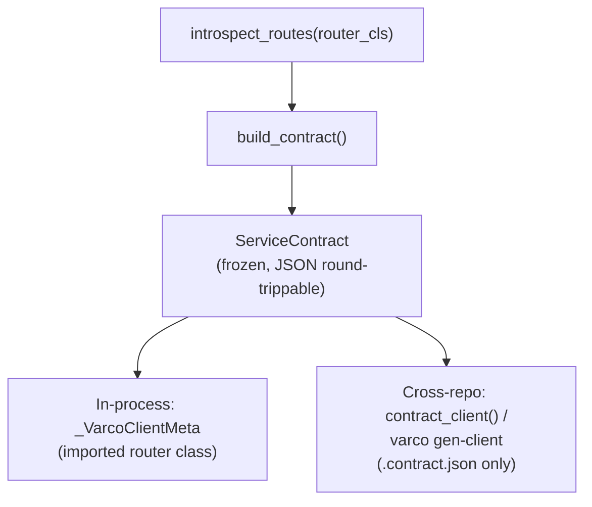

# Portable Service Contracts

Plan 009 (Phases 0 and 8) — `varco_fastapi.contract`. A `ServiceContract` is a
frozen, JSON-serializable descriptor of a `VarcoRouter`'s full route surface:
every route's method/path, every parameter's name/kind/JSON-Schema/required-
ness, and every request/response model, deduplicated into a flat `schemas`
registry.

It exists so that consuming another varco service does not require importing
that service's Python package. Two consumers read the identical descriptor:



> **Status note (drift from the plan — read before relying on this):**
> `build_contract()`, `ServiceContract`, and the codegen/runtime cross-repo
> path (`contract_client`, `varco gen-client`, `varco gen-client-stubs`) are
> fully implemented and tested. The **in-process path is not yet wired
> through the same mechanism**: `_VarcoClientMeta` (`varco_fastapi/client/base.py`)
> still builds every method — CRUD *and* custom `@route` — through its
> original, pre-Plan-009 closures (`custom_method(self, **kwargs: Any)` for
> custom routes). `build_client_method()` is used **only** by
> `contract_client_class()` (the cross-repo/synthesized path). This is a
> deliberate, plan-acknowledged deferral (high-blast-radius risk of
> regenerating every CRUD method on every existing client), but it means the
> "identical typed surface either way" guarantee below currently holds
> between the **two `build_client_method` resolvers**, not yet between
> `client_for()`'s live client and a `gen-client`-generated one. See
> `docs/client-code-generation.md` for the practical consequence.

## Format

```python
@dataclass(frozen=True)
class ServiceContract:
    contract_version: str          # wire-format version, e.g. "1.0"
    service_name: str
    routes: tuple[RouteContract, ...]
    schemas: dict[str, dict[str, Any]] = field(default_factory=dict)  # flat $defs registry
    base_path: str = ""
    service_version: str | None = None   # your app's own version, independent of contract_version
    description: str | None = None

@dataclass(frozen=True)
class RouteContract:
    name: str
    method: str
    path: str
    params: tuple[ParamContract, ...] = ()
    request_schema: dict[str, Any] | None = None
    response_schema: dict[str, Any] | None = None
    status_code: int = 200
    is_crud: bool = False
    crud_action: str | None = None
    async_capable: bool = True
    deprecated: bool = False
    summary: str | None = None
    description: str | None = None
    tags: tuple[str, ...] = ()

@dataclass(frozen=True)
class ParamContract:
    name: str
    kind: str              # "path" | "query" | "body" | "header"
    schema: dict[str, Any]  # JSON Schema fragment, may be a $ref
    required: bool = True
    default: Any = None
    description: str | None = None
```

`ServiceContract.to_json()` / `.from_json()` round-trip byte-for-byte through
`.to_dict()`/`.from_dict()` — this is the exact `.contract.json` shape that
`varco export-contract` writes and `varco gen-client` / `contract_client()`
read back with **no router import required** on the reading side.

| Table | Meaning |
|---|---|
| `Two version fields` | `contract_version` is the wire format's own version (starts at `"1.0"`); `service_version` is your app's independent release version. They evolve on different clocks. |
| `schemas` | Flat `$defs`-shaped registry — a Pydantic model referenced by three routes is emitted once and referenced from every route via `$ref`. |
| `ParamContract.kind` | `"path"` \| `"query"` \| `"body"` \| `"header"`. `Request`/`Response`/`BackgroundTasks`/`Depends(...)`/`ctx`/`auth`/`context`/`self` are excluded entirely — never appear in `params`. |

## The `$ref` rule

Every schema in `params[].schema` / `request_schema` / `response_schema` may
be **either** an inline JSON-Schema fragment (scalars, simple objects) **or**
a `{"$ref": "#/schemas/<ModelName>"}` pointer into `ServiceContract.schemas`.
Consumers must resolve `$ref` themselves — a ~15-line resolver ships in
`varco_fastapi/contract/schema.py` (`SchemaCollector`) and is reused by both
`ImportedTypeResolver`/`SynthesizedTypeResolver` (`varco_fastapi/client/method.py`).
The `schemas` block is deliberately OpenAPI-`$defs`-compatible, so
`datamodel-code-generator` remains a valid escape hatch for anything the
hand-rolled emitter in `contract/codegen.py` cannot represent (it degrades
unsupported shapes to `dict[str, Any]` with a `# TODO: unsupported schema`
comment rather than failing).

## Version policy

`CONTRACT_VERSION = "1.0"` (`varco_fastapi/contract/model.py`). On
`ServiceContract.from_dict()`/`.from_json()`:

- A **major** version mismatch (`"2.0"` read by a `"1.x"`-only build) raises
  `ContractVersionError` (a `ValueError` subclass) — a consumer must not
  silently misinterpret a breaking wire-format change.
- An **unknown minor** (`"1.3"` read by a `"1.0"` build) logs one WARNING and
  parses anyway — forward-compatible within a major version.

## Export → commit → generate → call

```bash
# 1. Export the contract from the service repo (CI job, or manually)
varco export-contract myapp.routers:OrderRouter -o order.contract.json \
    --service-name orders --service-version 2.3.0

# 2. Commit order.contract.json to the CONSUMING repo (not the producing one) —
#    it is the artifact that decouples the two repos.

# 3a. Generate a standalone, typed client module and check it in too:
varco gen-client -c order.contract.json -o order_client.py --class-name OrderClient

# 3b. ...or generate just the .pyi stub for an existing client_for()-style call site:
varco gen-client-stubs -c order.contract.json -o order_client.pyi

# 4. Call it — no import of myapp.routers anywhere in the consumer's dependency tree
```

```python
# 4a. Runtime one-liner (scripts/notebooks) — no generated file at all:
from varco_fastapi.contract.runtime import contract_client
client = contract_client("order.contract.json", "https://orders.internal")
order = await client.read(order_id)

# 4b. Generated module (checked in, step 3a):
from order_client import OrderClient
client = OrderClient("https://orders.internal")
order = await client.read(order_id)
```

## CI `--check` recipe

Detect stub drift (the exported contract changed but nobody regenerated the
`.pyi`) without regenerating anything:

```bash
varco gen-client-stubs myapp.routers:OrderRouter -o order_client.pyi --check
# exit 0 — up to date
# exit 1 — stale; prints a message to stderr naming the drift
# exit 2 — usage error (bad target, missing --contract/target)
```

Run this in the **producing** service's CI to catch a route change that
should have triggered a re-export, or in the **consuming** repo's CI (with
`-c order.contract.json` instead of a router target) to catch a stale
generated stub relative to the last-committed contract.

## The "identical surface" parity guarantee — and its actual enforcement today

The design goal: a consumer gets the exact same typed method signature
whether it imports the peer's router class (monorepo) or only has its
`.contract.json` (cross-repo). This is enforced by construction — both
resolvers (`ImportedTypeResolver`, `SynthesizedTypeResolver`) feed the same
`build_client_method(route, resolver)` — rather than by developer discipline,
and is guarded by two named tests that must never be deleted:

- `varco_fastapi/tests/test_client_typed_routes.py::TestResolverParity::test_resolver_parity`
- `varco_fastapi/tests/test_contract_codegen.py::TestSignatureParity::test_signature_parity`

**What they actually verify today**: that `build_client_method(route, ImportedTypeResolver(...))`
and `build_client_method(route, SynthesizedTypeResolver(...))` produce equal
`__signature__`s for the same `RouteContract`. Both the codegen path
(`varco gen-client`) and the runtime path (`contract_client()`) go through
`build_client_method`, so *they* are covered by this guarantee end to end.
`client_for()`'s in-process client does **not** yet call `build_client_method`
(see the status note above) — its custom-route methods still accept
`**kwargs: Any` with no static typing, so today the guarantee holds between
"cross-repo generated" and "cross-repo runtime", not yet between either of
those and "in-process `client_for()`".

See also: `docs/client.md`, `docs/client-code-generation.md`,
`docs/peer-service-integration.md`.
